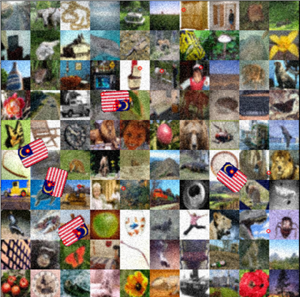
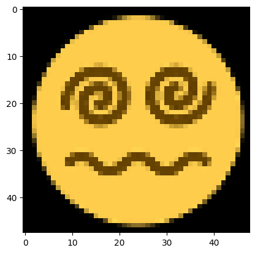
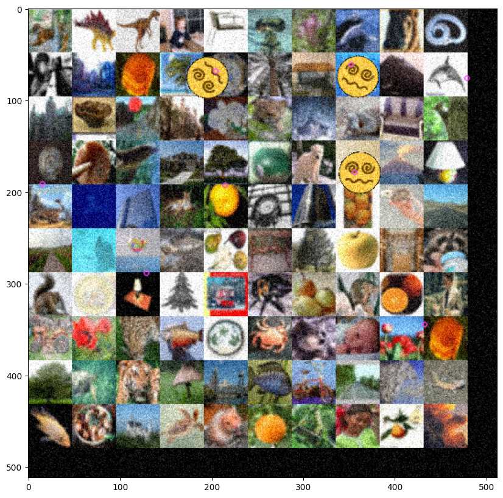
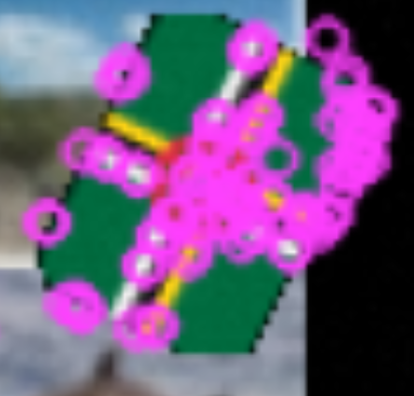
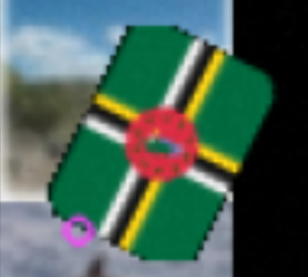

# Emoji Hunt Project

This project was done in partial fulfillment of the Computer Vision course at the University of Victoria. 

Given an example of a random emoji (from a bank of around 300), our algorithm found and matched the location of emojis. Score penalties were given for predicting the wrong number of emojis.

[The augmentations used to corrupt the emoji in the image and increase difficulty can be found here. The list used is in the Update Config section of the code.](https://imgaug.readthedocs.io/en/latest/source/overview_of_augmenters.html)

[A brief description on SIFT can be found here on Medium.com.](https://medium.com/@russmislam/implementing-sift-in-python-a-complete-guide-part-1-306a99b50aa5)

[And here is an example of matching points on the Eiffel tower in photos taken from two different angles.](https://www.analyticsvidhya.com/blog/2019/10/detailed-guide-powerful-sift-technique-image-matching-python/)

The emoji bank was largely filled with flags, and our algorithm was able to detect keypoints within them.

As well as match them to the image with the emoji superimposed on it.

It also worked with face emojis.

To increase the score and accuracy, our algorithm checked clusters of neighbourhoods and returned a single point from there.

